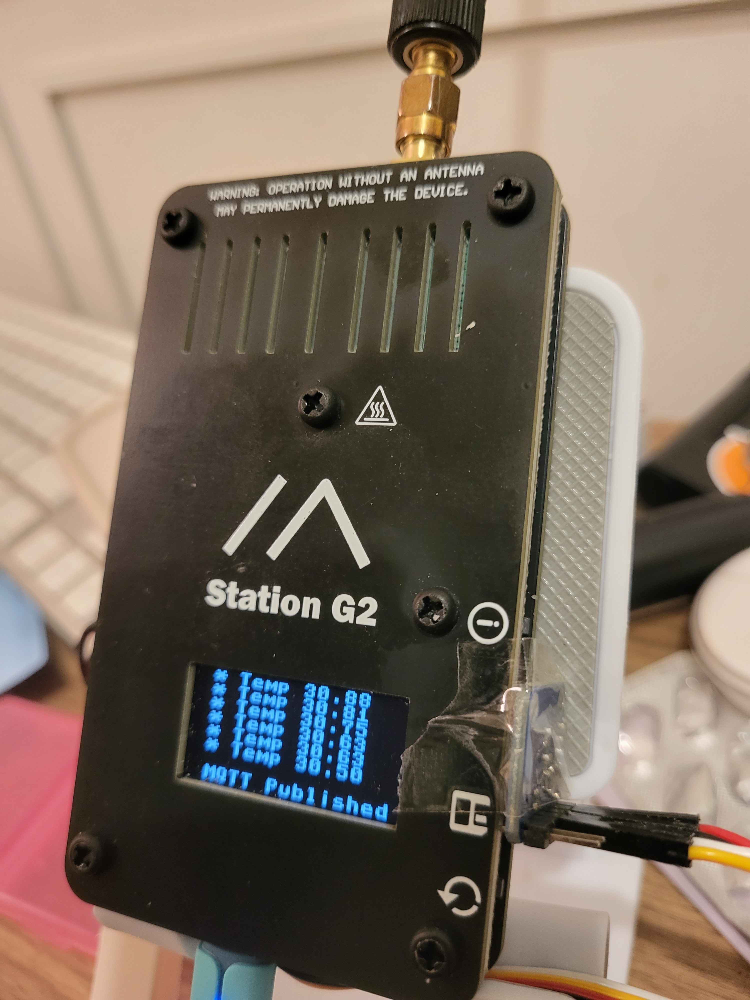

# Minimal LoRa G2

A Minimal LoRa Micropython implementation for the [G2 Station](https://wiki.uniteng.com/en/meshtastic/station-g2).

## Introduction

I have been writing the last few years a console-based LoRa firmware for various products (mostly [RAKwireless products](https://store.rakwireless.com/collections/wisblock)), called [Minimal LoRa](https://github.com/Kongduino?tab=repositories&q=minimal&type=&language=&sort=), which work more or less like an AT firmware, sans the AT crap. The firmware either sends whatever it receives on Serial (this being either USB, a second UART, or BLE, depending on the available options), or executes commands, prefixed with `/`.

This firmware has evolved and changed quite a bit along the years, and works across platforms, from nRF52840 to ESP32. I have a Xojo application that can manage some of these versions with a simple GUI. The current version has a compact binary format:

* 6 bytes for UUID
* 1 byte for packet type
  - 'P' for PING
  - 'G' for GNSS
  tbd
* The remaining 9 bytes depend on the type of packet. For PING it is:
  - PING count	2 bytes
  - CRC32		4 bytes	(see xcrc32.py file)
  - Padding		3 bytes	(0x03 x 3)
* For GNSS the location, 2 floats, ie 8 bytes, will take the place of CRC32 and ping count. The last byte could be CRC8 or Padding. TBD.

I have been lusting after a Station G2 for a while, and recently bought one – they are after all neighbours, in Foshan. Neil, the designer of these babies, was a darling and sent me two... So one  had to be repurposed for Micropython... The first thing I did was prepare a board definition for it. It is in the repository.

After that it was very easy. I have all the parts necessary – this is not my first Python Minimal LoRa – and apart from the OLED, a model that's compatible, but not quite, with SHT1107, it was just a question of copying and pasting code. There is no Serial input, so when it's running it basically won't take commands, except for one button, which is linked to the `sendPing` function. So settings are done pre-launch, in a couple of files:

* `friends.txt`, which contains the UUID of known devices, with a nickname.
* `mySettings.py`, which has all the passwords and whatnots necessary to work properly.

##  Installation

All the files required to run are in this repository. LoRa, AES, OLED, hexdump, AMG8833. The latter is optional: you can see below that I have inserted an infrared camera between the two acrylic plates, pointed in the general direction of the LoRa chip and LNA. The idea is to monitor the temperature: in case you transmit continuously, the chips could overheat, and we don't want that. I'll add code that alerts the user (and refuses to send) if the temperature reaches a certain threshold.



### Passwords, etc.

The `mySettings.py` file looks like this:

```python
SSID = "..."
PWD = "..."
pKey = bytearray("Yellow Submarine", 'ascii')
CLIENT_NAME = 'G2'
BROKER_ADDR = 'broker.hivemq.com'
BTN_TOPIC = "testG2/88888888"
myUUID = b'\xde\xca\xfb\xad\xba\xdd'
myUUIDtext = "DECAFBADBADD"
```

`SSID` and `PWD` are for the wifi; `pKey` is the encryption key for the LoRa packets. For testing, I am publishing to HiveMQ's public server. You can replace this with another MQTT broker of your choice. Finally myUUID is the device's UUID, with a textual version. Pick your own :-) The 6 bytes of the UUID are the first six bytes of the packet.

The `friends.txt` file is a list of tab separated lines listing UUIDs and nicknames. It looks like this:

```
7b1128f5c111	Guethenoc
371be23426fc	Roparzh
```

Again, make up your own UUIDs. These two are my M5Stack CardPuters.
